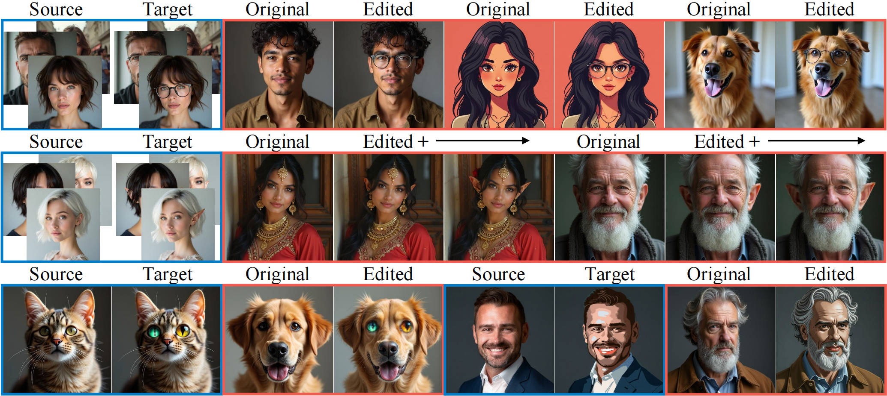

# PairEdit (NeurIPS 2025)
<a href='https://arxiv.org/abs/2506.07992'></a>

Official Implementation of **"PairEdit: Learning Semantic Variations for Exemplar-based Image Editing"**. 

## Abstract
>Recent advancements in text-guided image editing have achieved notable success by leveraging natural language prompts for fine-grained semantic control. However, certain editing semantics are challenging to specify precisely using textual descriptions alone. A practical alternative involves learning editing semantics from paired source-target examples. Existing exemplar-based editing methods still rely on text prompts describing the change within paired examples or learning implicit text-based editing instructions. In this paper, we introduce PairEdit, a novel visual editing method designed to effectively learn complex editing semantics from a limited number of image pairs or even a single image pair, without using any textual guidance. We propose a target noise prediction that explicitly models semantic variations within paired images through a guidance direction term. Moreover, we introduce a content-preserving noise schedule to facilitate more effective semantic learning. We also propose optimizing distinct LoRAs to disentangle the learning of semantic variations from content. 


=======

## Training
training semantic LoRA using python script：

`python train_image_script.py --c=train_image`

this command will use `train_image.yaml` of `config` folder to train, then the trained semantic LoRA will save to output_folder，for example：

`output/models/image/pixel/pixel_vtrain_image_4.0eta_3.0ns_full_base_v1/pixel_4.0eta_3.0ns_28inf_500epoch.pt`

## Inference
inference python script:

`python gen_image_script.py --c=train_image`

the script generate image using `train_image.yaml`

## Real Image Editing
### Config file
the config file of real image editing, for example `train_image_real.yaml` contains additional configs：

```yaml
image_ids: # the real image id(real image file name) of particular will be used to train a inversion LoRA
  - 610

semantic_lora_path: "output/models/pretrained/elf.pt" # the pretrained semantic LoRA used for editing
semantic_cfg_scale: 0.75 # the CFG strength of semantic LoRA
```
### Training and editing
training:

`python train_image_real_script.py --c=train_image_real`

inference：

`python gen_image_real_script.py --c=train_image_real`
## Tested environment
python==3.9.19
cuda: 12.1

# Acknowledgements
Our code is mainly based on [Concept Slider](https://github.com/rohitgandikota/sliders). Huge thanks to the authors for their amazing work!
